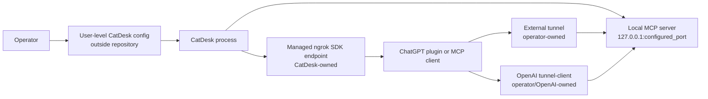

# Stable MCP Transport Architecture

Ticket: T-0025A  
Status: architecture and implementation plan only  
Base commit: d9843f5d43a9fa86a99cb0c2c8a33da27c74d73d  
Branch: infra/stable-mcp-transport  
Worktree: C:\Users\Volap\OneDrive\Desktop\Projects\CatDesk-stable-mcp

## Goal

CatDesk currently exposes its local MCP server through a managed ephemeral ngrok
tunnel. The generated public host and generated MCP route can change after
restart, which forces the operator to update or recreate the ChatGPT plugin.

T-0025 introduces stable transport modes while preserving the existing behavior
as the rollback path. T-0025A does not change runtime behavior. It records the
target architecture, configuration, process-ownership rules, tests, and rollback
strategy for later implementation phases.

## Current Behavior Observed

Current source inspection shows:

- `src/main.rs` starts the local Axum MCP server on the selected port and then
  calls `ngrok::start`.
- `src/ngrok.rs` creates an embedded ngrok SDK session, forwards to
  `http://127.0.0.1:<port>`, stores the returned public base URL in
  `AppState.ngrok_url`, and logs both the base URL and full MCP URL.
- `src/state.rs` stores user configuration in `~/.catdesk/config.toml` today,
  generates `AppState.mcp_slug` on startup, and derives the route as
  `/<mcp_slug>/mcp`.
- `src/server.rs` mounts the MCP HTTP endpoint at the supplied route path.
- The headless path already has stricter explicit auth and route validation, but
  the interactive managed-ngrok path remains legacy-compatible.

No runtime code is changed by this document.

## Transport Ownership Diagram



Ownership rules:

- CatDesk owns only the local MCP server and tunnel tasks it starts itself.
- CatDesk may cancel its own embedded ngrok SDK task.
- CatDesk must not kill unrelated `ngrok.exe` processes, Windows services, or
  operator-managed tunnels.
- External tunnel mode makes CatDesk a localhost server only.
- OpenAI Secure MCP Tunnel mode, if later proven, is a separate tunnel-client
  lifecycle and must not be silently substituted for public endpoint mode.

## Mode A: Legacy Managed Ephemeral Ngrok

Purpose:

- Preserve current startup behavior as the compatibility and rollback mode.
- Keep existing user workflows working while stable modes are developed.

Design:

- Default mode remains `managed_ephemeral_ngrok` when no new transport
  configuration exists.
- CatDesk generates the route as it does today.
- CatDesk starts the embedded ngrok SDK endpoint as it does today.
- No persistent route is required.
- Existing ngrok authtoken loading remains supported.
- Existing ChatGPT plugin authentication behavior is preserved. The current
  custom plugin path is configured as No Authentication and does not expose a
  generic static bearer-token field that CatDesk can rely on.

Required T-0025B/C constraints:

- Do not change tool exposure, worker runtime, Qwen/Ollama behavior, DeepSeek,
  shell policy, Git policy, or verification requirements.
- Add redaction in later phases without breaking the current connection flow.
- Preserve an explicit rollback path to this mode.

## Mode B: Managed Stable Ngrok

Purpose:

- Keep a single CatDesk startup workflow while making the complete plugin URL
  stable across restarts.

Target connection identity:

```text
https://<operator-configured-stable-ngrok-domain>/<persistent-route>/mcp
```

Design:

- CatDesk starts the local MCP server on `127.0.0.1:<port>`.
- CatDesk starts an embedded ngrok SDK HTTP endpoint with an operator-provided
  stable domain.
- CatDesk appends a persistent route generated once and stored outside the
  repository.
- CatDesk verifies the local upstream is healthy before reporting the endpoint
  usable.
- CatDesk displays only a redacted URL summary by default.
- If used with the current No Authentication ChatGPT plugin shape, this mode is
  explicitly development-only. Anyone with the complete URL may be able to
  invoke enabled CatDesk tools.
- Persistent route secrecy is only a route secret and defense-in-depth. It is
  not true authentication.

Evidence:

- ngrok's Rust quickstart documents starting an Agent endpoint from Rust and
  setting a reserved domain through the SDK with `.domain(domain)` before
  `listen_and_forward`.
- ngrok's domain documentation says every account has a generated Dev Domain
  and that the value cannot be arbitrarily chosen on free accounts.

Risks:

- Stable domains are account resources. The operator must configure the real
  domain outside the repository.
- Domain conflicts must fail closed; CatDesk must not silently start an
  ephemeral endpoint if stable mode fails.

## Mode C: External Tunnel

Purpose:

- Let a tunnel survive CatDesk rebuilds and restarts.
- Support a user-managed ngrok service, manually started ngrok process, or a
  future tunnel provider without CatDesk managing that process.

Design:

- CatDesk starts only the local MCP server.
- CatDesk validates the configured public base URL shape but does not launch
  or stop the tunnel.
- CatDesk performs a local health check.
- Optional remote self-check is disabled by default and must be explicitly
  enabled because it exercises a public endpoint.
- Full URL is redacted from standard logs and ordinary UI.

Process boundary:

- CatDesk never sends stop/kill signals to external tunnel processes.
- CatDesk shutdown releases only its local listener and internal state.
- Rebuild/restart of CatDesk should leave the public tunnel process untouched.

## Mode D: OpenAI Secure MCP Tunnel

Purpose:

- Evaluate private MCP connectivity without exposing CatDesk through a public
  ngrok endpoint.

T-0025A decision:

- Feasible enough for a later gated spike, but not ready for runtime
  implementation in T-0025B/C.
- Treat as `SUPPORTED_BUT_MANUAL_ONLY_PENDING_LOCAL_PROOF`.

Rationale:

- Official OpenAI docs describe Secure MCP Tunnel as an outbound tunnel-client
  that forwards queued MCP JSON-RPC requests to a private MCP server.
- Official plugin testing docs say ChatGPT developer mode can choose a Tunnel
  connection and select a tunnel or enter a `tunnel_id`.
- Official plugin deployment docs say Secure MCP Tunnel is for private or
  developer-mode connections and does not satisfy public plugin submission
  requirements.

Implementation gate:

- Do not implement this mode until T-0025D verifies the tunnel-client binary,
  Windows support, Platform tunnel permissions, ChatGPT developer-mode access,
  local endpoint compatibility, credential storage, and lifecycle management.

## Persistent Route Design

Route goals:

- The route is stable in managed stable and external modes.
- The route remains high entropy and non-guessable.
- The route is not authentication and must not be described as equivalent to
  bearer-token, OAuth, or private-network controls.
- The route is never committed, logged in full, or included in review bundles.

Generation:

- Generate a route identifier with a cryptographically secure random source.
- Encode as URL-safe unpadded base64 or a conservative slug alphabet.
- Require a route length between 24 and 96 characters.
- Store only the slug, not the `/mcp` suffix.
- Mount `/<route_id>/mcp`.

Storage:

- Store route configuration in user-level CatDesk config outside the repository.
- T-0025B must extend the existing `%USERPROFILE%\.catdesk\config.toml`.
- Do not introduce a second active config root during the first runtime phase.
- A future optional migration ticket may move CatDesk config to a more standard
  Windows user-level location after compatibility, migration, and rollback are
  reviewed.
- Route storage must use atomic writes.
- T-0025B should apply owner-restricted file permissions or best-effort Windows
  ACL hardening. If permissions cannot be restricted, CatDesk must warn the
  operator and continue only according to the selected mode's risk policy.
- The route must not be written to crash output, normal logs, review bundles, or
  project-local `.catdesk` files.

Rotation:

- Rotation is an explicit operator action.
- T-0025B/C route rotation is restart-required.
- Rotation generates and atomically saves a new route ID.
- CatDesk marks restart required and displays only a redacted fingerprint.
- On controlled restart, the new route becomes active and the old route becomes
  invalid.
- Do not design dynamic Axum route remounting for the first transport version.
- Rotation records only a redacted fingerprint.

Redaction:

- Standard logs show `https://<host>/<redacted>/mcp`.
- Diagnostics show a short connection fingerprint, not the route.
- Review bundles exclude route values and public endpoint URLs.
- A deliberate copy or one-time reveal action is the only normal path that
  returns the complete URL to the operator.

## Source Module Implementation Plan

T-0025B should add structure without changing delegated-worker behavior:

- `src/tunnel.rs`: tunnel mode enum, transport config validation, redaction
  helpers, route ID generation, connection fingerprinting.
- `src/tunnel_config.rs` or a `state.rs` submodule: extend the existing
  `%USERPROFILE%\.catdesk\config.toml`, save defaults, and perform atomic
  persistence without adding a second config root.
- `src/ngrok.rs`: split legacy start from stable-domain start, but keep legacy
  behavior unchanged when mode is `managed_ephemeral_ngrok`.
- `src/main.rs`: select tunnel mode and route from config before starting
  server/ngrok; add UI commands later without changing worker logic.
- `src/state.rs`: store transport status fields and persistent route metadata,
  avoiding full URL logs.
- `src/server.rs`: optionally expose redacted health/identity fields through
  existing read-only instruction or health response.

Code that must remain untouched unless separately approved:

- `src/delegated/runtime.rs`
- `src/delegated/integrated.rs`
- DeepSeek advisor code
- MCP supervisor tool semantics
- patch, journal, shell, Git, and verification policy

## Server Identity

Later phases should add a read-only identity payload:

```json
{
  "installationId": "uuid-stable-across-restarts",
  "serverInstanceId": "uuid-per-process",
  "gitCommit": "d9843f5d43a9fa86a99cb0c2c8a33da27c74d73d",
  "dirtyBuild": false,
  "binarySha256": "redacted-or-short-safe-fingerprint",
  "startupTime": "RFC3339",
  "workspaceHash": "redacted-workspace-fingerprint",
  "transportMode": "managed_stable_ngrok",
  "connectionFingerprint": "12 hex chars"
}
```

This lets ChatGPT confirm it reached the intended CatDesk instance after a
restart without exposing the full route or token. It must support both plugin
continuity checks and stale-binary detection.

## Authentication Compatibility

The current ChatGPT custom plugin uses No Authentication. T-0025B must not make
`require_auth_token` an unconditional default for plugin-facing traffic until a
compatible ChatGPT authentication path is proven.

Compatibility posture:

- Legacy managed ephemeral ngrok preserves current authentication behavior.
- Stable public ngrok without application-layer authentication is
  development-only and must display a prominent warning.
- Persistent route secrecy is not a substitute for authentication.
- OAuth is out of scope for T-0025.
- OpenAI Secure MCP Tunnel remains the preferred future private connection path
  when available and proven locally.

## PR Strategy

- Keep this branch based on the reviewed stabilization commit.
- Review and commit T-0025 phases independently.
- Target the first stable transport PR into
  `codex/delegated-loop-qwen36-stabilization`, not `main`.
- Merge stabilization to `main` before final tunnel integration only after user
  approval.
